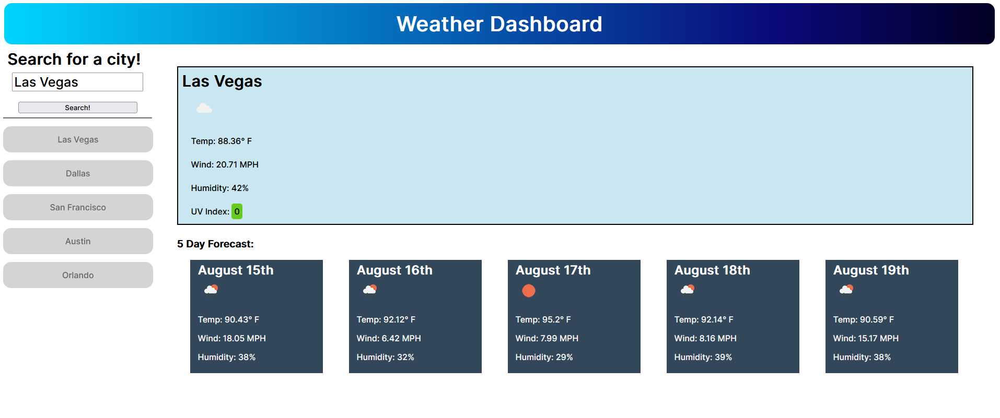

# Weather Dashboard

## Description

This project was a test of everything I've been working to develop over the last two months, and some server-side api testing.  I built this project to have easy access to checking the weather before a vacation or before you go out on the town. The whole project really helped me realize how much I've improved and how to deal with api calls.

***

## Table of Contents

  - [Description](#description)
  - [Usage](#usage)
  - [Credits](#credits)
  - [License](#license)

***

## Usage

Here is what the website looks like.  If you want to preview it click [HERE!](https://parksfg.github.io/Weather-Dashboard/)

***

## Credits

I am the sole developer for this project, but thanks to [OpenWeather](https://openweathermap.org/api) for their API

***

## License

MIT License

Copyright (c) 2022 Parker Gay

Permission is hereby granted, free of charge, to any person obtaining a copy of this software and associated documentation files (the "Software"), to deal in the Software without restriction, including without limitation the rights to use, copy, modify, merge, publish, distribute, sublicense, and/or sell copies of the Software, and to permit persons to whom the Software is furnished to do so, subject to the following conditions:

The above copyright notice and this permission notice shall be included in all copies or substantial portions of the Software.

THE SOFTWARE IS PROVIDED "AS IS", WITHOUT WARRANTY OF ANY KIND, EXPRESS OR IMPLIED, INCLUDING BUT NOT LIMITED TO THE WARRANTIES OF MERCHANTABILITY, FITNESS FOR A PARTICULAR PURPOSE AND NONINFRINGEMENT. IN NO EVENT SHALL THE AUTHORS OR COPYRIGHT HOLDERS BE LIABLE FOR ANY CLAIM, DAMAGES OR OTHER LIABILITY, WHETHER IN AN ACTION OF CONTRACT, TORT OR OTHERWISE, ARISING FROM, OUT OF OR IN CONNECTION WITH THE SOFTWARE OR THE USE OR OTHER DEALINGS IN THE SOFTWARE.
